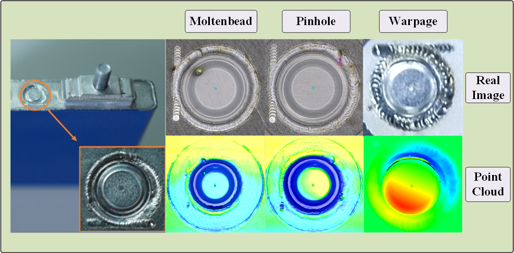
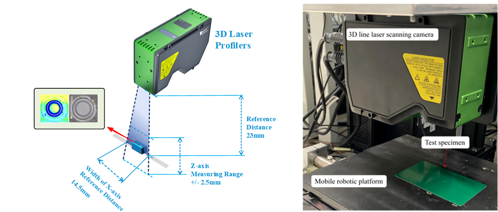

LGANet： An improved Graph Attention Network for Semantic Segmentation of Industrial Point Clouds in Automotive Battery Sealing Nail Defect Detection


# Sealing Nail Defect Detection System

## Project Overview

<p align="center">
  
</p>


This project implements a defect detection system for automotive battery sealing nails based on graph neural networks (GNNs). It uses point cloud data to classify surface defects. The system leverages a custom graph attention mechanism for feature extraction, enabling robust detection of various defect types on metal surfaces.

### Supported Defect Types

* Burst
* Pit
* Stain
* Warpage
* Pinhole
* Other background categories

---


## Data Acquisition


<p align="center">
  
</p>

The dataset used in this project is collected from real-world industrial production lines for automotive battery sealing nail inspection.

All point cloud data are acquired using industrial 3D vision systems deployed in controlled manufacturing environments, covering various defect types such as surface deformation, misalignment, and structural anomalies of sealing nails. The image acquisition and imaging module consists of
a Laser Profiler as a 3D scanning system (OPT-LPC20 Laser Profiler) with a mobile robotic platform and a test specimen. 
The laser profiler is configured in linear scanning mode. The system uses a blue laser stripe (wavelength 405nm) with a profile acquisition rate of 10,000 profiles per second, ensuring high fidelity on metallic reflective surfaces.
During scanning, the sealing nails were placed on a precision rotary stage to ensure uniform coverage. The scanning speed was set to 10mm/s, and each profile captured 3000 points across the horizontal axis, resulting in a lateral resolution of ~0.05mm and vertical depth accuracy of <0.01mm. All scans were manually verified for completeness and noise artifacts.The battery is mounted on the mobile robot platform, and the calibrated 3D line laser scanning camera projects laser stripes onto the sealing nail area of the battery. Through synchronized image data acquisition during planar scanning trajectories, surface data of thesealing nail specimen are obtained.The data are manually annotated following a strict quality control process to ensure labeling accuracy and consistency.

---

## Technical Architecture

* Built on the PyTorch deep learning framework
* Employs Graph Attention Networks (GATs) for feature extraction
* Custom `EdgeConv` and `GraphConv` modules for point cloud processing
* Multi-scale encoder–decoder structure for feature fusion

---

## Requirements

* Python 3.x
* PyTorch
* NumPy
* CUDA (recommended for GPU acceleration)
* Custom `pointops` library for point cloud operations

---

## Environment Setup

### Recommended: Use Conda

1. Create a new Conda environment:

   ```bash
   conda env create -f environment.yml
   ```

2. Activate the environment:

   ```bash
   conda activate sealingnail
   ```

3. Install PyTorch with CUDA:

   ```bash
   conda install pytorch torchvision torchaudio pytorch-cuda=11.8 -c pytorch -c nvidia
   ```

4. Install other dependencies:

   ```bash
   conda install numpy scipy scikit-learn
   conda install -c conda-forge open3d
   conda install tqdm tensorboard h5py
   ```

5. Ensure C++/build tools (Linux):

   ```bash
   sudo apt install g++
   sudo apt install build-essential
   sudo apt install ninja-build
   ninja --version
   ```

6. Install custom pointops library:

   ```bash
   cd lib/pointops
   python setup.py install
   ```

7. Verify installation:

   ```bash
   python -c "import torch; print(torch.__version__); print(torch.cuda.is_available())"
   ```

---

## Dataset Structure
Data can be downloaded from 
TXT format: https://drive.google.com/file/d/1zyCQI2J5TFcRKKLp0KkUvsXCY-D-nVCV/view?usp=drive_link
NPZ format: https://drive.google.com/file/d/1_ni0_XzQVsQ5ehoDo1MfV0wjTkiN1XjO/view?usp=drive_link
The dataset is organized as follows:

```
data/sealingNail_normal/
├── train/    # Training set
└── test/     # Test set
```

Each point cloud file contains:

* 3D coordinates (x, y, z)
* Surface features (3 channels)
* Semantic labels

---

## Model Architecture

The model adopts an encoder–decoder structure:

1. **Encoder**: Multi-layer graph attention modules with progressive downsampling
2. **Decoder**: Multi-scale feature fusion via skip connections
3. **Classification Head**: Outputs per-point semantic predictions

---

## Usage

### Train the Model

```bash
python train.py
```

Training includes:

* Data loading and preprocessing
* Class weight computation to handle imbalance
* Model checkpoint saving
* Real-time training and validation metrics

---

### Demo Inference

Run on a single sample:

```bash
python demo.py --input data/test_sample.ply --model checkpoints/best_model.pth --output results/
```

Batch inference:

```bash
python batch_demo.py --input data/test_folder/ --model checkpoints/best_model.pth --output results/
```

Visualization:

```bash
python visualize.py --ply results/labeled_cloud.ply
```

Export HTML report:

```bash
python export_report.py --input results/ --output reports/
```

---

## Model Evaluation

The system supports multiple evaluation metrics:

* Overall Accuracy (OA)
* Mean Accuracy (mAcc)
* Mean Intersection over Union (mIoU)
* Per-class IoU

---

## Project Structure

```
├── model/           # Model definitions
│   └── sem/         # Semantic segmentation modules
├── util/            # Utility functions
├── lib/             # Custom operators
│   └── pointops/    # Point cloud operations
├── data/            # Datasets
└── train.py         # Training script
```

---

## Notes

1. Ensure your CUDA environment is correctly installed
   Check with:

   ```bash
   nvidia-smi
   ```

2. Compile the pointops library before first run

3. Adjust `batch_size` according to available GPU memory

4. Training logs and model weights are saved under the `logs/` directory


## Citation

If you consider our work useful, please cite:

```bibtex
@article{pan2026improved,
  title   = {An improved graph attention network for semantic segmentation of industrial point clouds in automotive battery sealing nail defect detection},
  author  = {Pan, Wei and Wu, Yuhao and Tang, Wenming and Lu, Qinghua and Zhang, Yunzhi},
  journal = {Engineering Applications of Artificial Intelligence},
  volume  = {163},
  pages   = {112793},
  year    = {2026},
  publisher = {Elsevier}
}
```


## 🙏 Acknowledgements

This work was supported in part by **OPT Machine Vision** through internal research and development projects on industrial 3D vision and point cloud inspection systems.

The authors would like to thank all collaborators involved in data collection, annotation, and system deployment for automotive battery sealing nail inspection. We also appreciate the constructive feedback from anonymous reviewers, which helped improve the quality and clarity of this work.

In addition, we acknowledge the open-source contributions from the community. This project benefits from several excellent open-source works in point cloud processing and graph-based learning, including but not limited to:

- [PointNet++](https://github.com/charlesq34/pointnet2)
- [DGCNN](https://github.com/WangYueFt/dgcnn)
- [DeepGCN](https://github.com/lightaime/deep_gcns_torch)
- [PointNeXt](https://github.com/guochengqian/PointNeXt)
- [PointOps](https://github.com/POSTECH-CVLab/pointops)

We sincerely thank the authors of these works for making their code publicly available, which greatly facilitated reproducibility and comparative evaluation. 
Parts of the implementation are adapted or inspired by prior works, with appropriate modifications for industrial point cloud segmentation scenarios.

